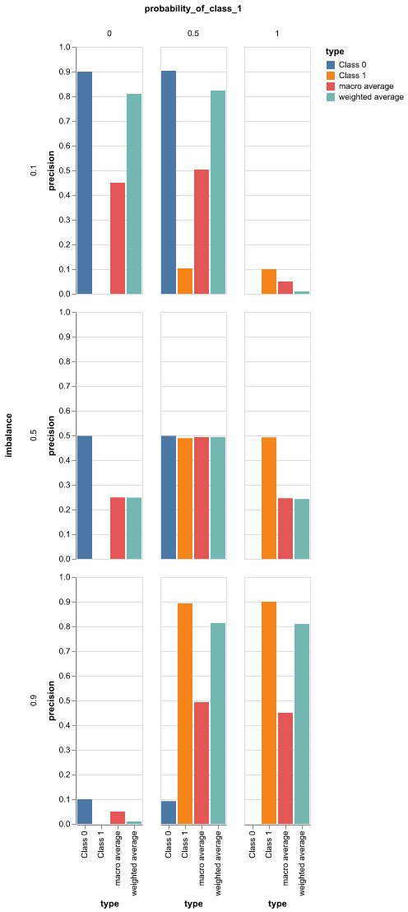
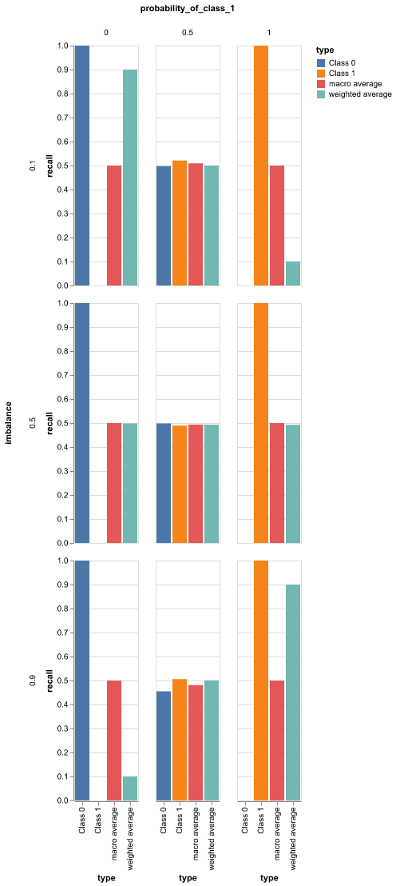

## Evaluating Classifier Performance with Imbalanced Data

- [Evaluating Classifier Performance with Imbalanced Data](#evaluating-classifier-performance-with-imbalanced-data)
  - [Introduction](#introduction)
  - [Definitions of Metrics](#definitions-of-metrics)
    - [Threshold dependent metrics](#threshold-dependent-metrics)
      - [Confusion Matrix](#confusion-matrix)
        - [Structure](#structure)
        - [Uses](#uses)
        - [Importance](#importance)
      - [Accuracy](#accuracy)
      - [Precision](#precision)
      - [Recall (Sensitivity)](#recall-sensitivity)
      - [F1-Score](#f1-score)
    - [Threshold independent metrics](#threshold-independent-metrics)
      - [AUROC (Area Under the ROC Curve)](#auroc-area-under-the-roc-curve)
      - [PR Curve](#pr-curve)
  - [Experimental Setup](#experimental-setup)
  - [Results](#results)
    - [Accuracy](#accuracy-1)
    - [Precision](#precision-1)
    - [Recall](#recall)
    - [F1 Score](#f1-score-1)
    - [Confusion Matrix](#confusion-matrix-1)
    - [ROC Curve](#roc-curve)
    - [PR Curve](#pr-curve-1)
  - [Discussion](#discussion)
  - [Conclusion](#conclusion)
  - [References](#references)

### Introduction

If you are into deep learning or machine learning you would have wanted to understand the performance of your model. There are several metrics available for measuring performance. However, if you get stuck in the horrible situation of solely focusing numbers without looking closely at what is happening, you are just deluding yourself and not assessing the situation fairly.

Using this post I want to spread awareness about some common pitfalls that you can encounter and how to potentially avoid them. Hopefully it will add value to your skills. I will be limiting the scope of the discussion to binary classification metrics which is probably one of the most common modeling problem. 

Evaluating a classifier involves understanding how well your model makes prediction given certain input(s) using metrics like accuracy, precision, recall, F1-score, and AUROC. There is no magic metric and value that can be applicable to every use case. These will depend on several factors including your data distribution, tolerance to false positives of false negatives etc. 

Class imbalance can significantly affect the metrics, leading to misleading interpretations. We will analyze the impact of class imbalance and different classifiers namely: random, always 0 and always 1, on these metrics. Let us start with the definition of these metics. 

### Definitions of Metrics
#### Threshold dependent metrics
All the metrics in this section are dependent on the choice of threshold and will change based on the choice. So always ask what was the threshold used for calculating them. 

##### Confusion Matrix

A **confusion matrix** is a table used to evaluate the performance of a classification algorithm. It provides a detailed breakdown of the model's predictions compared to the actual outcomes. The matrix consists of four key components:

- **True Positives (TP)**: The number of instances correctly predicted as positive.
- **True Negatives (TN)**: The number of instances correctly predicted as negative.
- **False Positives (FP)**: The number of instances incorrectly predicted as positive (also known as Type I error).
- **False Negatives (FN)**: The number of instances incorrectly predicted as negative (also known as Type II error).

###### Structure

The confusion matrix is typically structured as follows:

|                     | **Predicted Positive** | **Predicted Negative** |
| ------------------- | ---------------------- | ---------------------- |
| **Actual Positive** | True Positives (TP)    | False Negatives (FN)   |
| **Actual Negative** | False Positives (FP)   | True Negatives (TN)    |

###### Uses

- **Performance Metrics**: From the confusion matrix, you can derive various performance metrics such as accuracy, precision, recall, and F1-score.
- **Error Analysis**: It helps identify specific areas where the model is making errors, allowing for targeted improvements.

###### Importance

The confusion matrix provides a comprehensive view of how well a classification model is performing, especially in terms of distinguishing between different classes. It is particularly useful in imbalanced datasets, where accuracy alone can be misleading.

##### Accuracy

Accuracy measures the ratio of correctly predicted samples to the total samples. This is probably the most misleading and useless metric you could blindly rely on. Strongly susceptible to class imbalance and gives near perfect scores for extremely imbalanced datasets. No real dataset will be balanced unless you make it so. "For heavily imbalanced datasets, where one class appears very rarely, say 1% of the time, a model that predicts negative 100% of the time would score 99% on accuracy, despite being useless." [3] The range of accuracy is 0 to 1. 

$$
\text{Accuracy} = \frac{TP + TN}{TP + TN + FP + FN}
$$

##### Precision

Precision measures the ratio of true positive predictions to the total positive predictions. From an information retrieval perspective, it measures the faction of relevant instances among the retrieved instances [2]. Its range is 0 to 1. This means out of all the positive predictions of the model how many of those were correct. An example where precision would be important is spam filter, you wouldn't want your important emails to be misclassified as spam. 

$$
\text{Precision} = \frac{TP}{TP + FP}
$$

##### Recall (Sensitivity)

Recall measures the ratio of true positive predictions to the actual positive instances. It is the fraction of relevant instances there were retrieved. In order words, out of all the positives in your set, how many were correctly identified as positive by your model. The range of recall is 0 to 1. Precision and recall are more robust to class imbalance. A typical example where recall is important is in the case of cancer detection. A false negative is several times worse than a false positive. Precision and recall are often competing metrics that have inverse relationship and so you'd typically value one over the other. [3]

$$
\text{Recall} = \frac{TP}{TP + FN}
$$

##### F1-Score

The F1-score is the harmonic mean of precision and recall, providing a balance between the two metrics. If you value for precision and recall, you can look at the F1-score. 

$$
\text{F1-Score} = 2 \times \frac{\text{Precision} \times \text{Recall}}{\text{Precision} + \text{Recall}}
$$

#### Threshold independent metrics

##### AUROC (Area Under the ROC Curve)
The **Area Under the Receiver Operating Characteristic (AUROC)** curve is a performance metric used to evaluate the ability of a binary classifier to distinguish between positive and negative classes across all possible classification thresholds. Here's a detailed definition:

- **ROC Curve**: The ROC curve is a graphical plot that illustrates the performance of a binary classifier by plotting the True Positive Rate (TPR) against the False Positive Rate (FPR) at various threshold settings.

- **AUC (Area Under the Curve)**: The AUROC is the area under the ROC curve. It provides a single scalar value that summarizes the overall performance of the classifier. The AUROC ranges from 0 to 1:
  - **0.5**: Indicates no discriminative ability, equivalent to random guessing.
  - **1.0**: Represents perfect discrimination, where the model perfectly distinguishes between classes.

- **Interpretation**: The AUROC can be interpreted as the probability that a randomly chosen positive instance is ranked higher than a randomly chosen negative instance by the classifier.

- **Threshold-Invariant**: It evaluates performance across all classification thresholds.

- **Use Cases**: AUROC is particularly useful for comparing models in binary classification tasks, especially when class distributions are balanced. However, it may not be as informative as the Precision-Recall curve in highly imbalanced datasets.

As a graph a y=x line would represent random classifier while y=1 line would be ideal classifier. [This](https://developers.google.com/machine-learning/crash-course/classification/roc-and-auc) article has excellent explanation for ROC and PR curves. I encourage you to read it. 

##### PR Curve

A **Precision-Recall (PR) curve** is a graphical representation that illustrates the trade-off between precision and recall for different threshold values in a binary classification task. 

- **Precision** (y-axis) is the ratio of true positive predictions to the total number of positive predictions (true positives + false positives).
- **Recall** (x-axis), also known as sensitivity, is the ratio of true positive predictions to the total number of actual positive instances (true positives + false negatives).

The PR curve is particularly useful for evaluating the performance of models on imbalanced datasets, where the positive class is of greater interest. It helps in understanding how well a model can identify positive instances while minimizing false positives.

### Experimental Setup
The experiment involves evaluating the performance of binary classifiers under varying conditions of class imbalance and prediction probabilities. A synthetic dataset is generated with 10,000 samples, where the true class labels (`y_true`) are created based on specified imbalance ratios (0.5, 0.1, 0.9), representing balanced, minority, and majority class scenarios, respectively. Prediction scores (`y_scores`) are generated with probabilities of predicting class 1 set to 0 (biased), 0.5 (random), and 1 (biased).

For each combination of probability and imbalance, key performance metrics are computed, including accuracy, precision, recall, F1-score, and AUROC. Confusion matrices are constructed to visualize the distribution of true positives, false positives, true negatives, and false negatives. Precision-Recall (PR) and ROC curves are plotted to assess the trade-offs between precision and recall, and the ability to differentiate between classes across thresholds.

The results are visualized for confusion matrices, ROC/PR curves and classification reports, providing a comprehensive view of classifier performance under different scenarios. The aim is to understand how class imbalance and prediction biases affect various evaluation metrics, offering insights into model robustness and reliability.

### Results
This section contains the results from the experiments. For accuracy, precision, recall, f1-scores the rows represent the percentage of imbalance. The columns are all 0 biased, random and all 1 biased classifiers. 

#### Accuracy 

#### Precision 

#### Recall 

#### F1 Score 

#### Confusion Matrix 

#### ROC Curve 

#### PR Curve 

### Discussion

| **Metric**           | **Behavior Across Classifier Types**                                                                                          | **Impact of Class Imbalance**                                                                                                                                            | **When to Use**                                                                        | **Key Considerations**                                                                                                              |
| -------------------- | ----------------------------------------------------------------------------------------------------------------------------- | ------------------------------------------------------------------------------------------------------------------------------------------------------------------------ | -------------------------------------------------------------------------------------- | ----------------------------------------------------------------------------------------------------------------------------------- |
| **Accuracy**         | - **Random**: Equal to 0.5. - **All 1**: Equals positive class proportion - **All 0**: Equals negative class proportion | - Highly sensitive; can be misleading in imbalanced datasets                                                                                                             | - Use in balanced datasets or when all classes are equally important                   | - Can be deceptive in imbalanced datasets; consider other metrics for a more comprehensive evaluation                               |
| **Precision**        | - **Random**: Macro average is equal to 0.5.  - **All 1**: Class 0 precision is 0.  - **All 0**: Class 1 precision 0.   | - Cases where the number of actual positives is very, very low, say 1-2 examples in total, precision is less meaningful and less useful as a metric [3].                 | - When the cost of false positives is high (e.g., spam detection, medical diagnosis)   | - Should be balanced with recall; precision alone may not capture overall performance                                               |
| **Recall**           | - **Random**: Equal to 0.5 - **All 1**: Macro average 0.5 always. - **All 0**: Macro average always 0.5                 | - In an imbalanced dataset where the number of actual positives is very, very low, say 1-2 examples in total, recall is less meaningful and less useful as a metric [3]. | - When missing positive instances is costly (e.g., disease detection, fraud detection) | - High recall alone doesn't ensure good performance; consider precision as well                                                     |
| **F1 Score**         | - **Random**: Near 0.5. - **All 1**: Class 1 precision always 0. - **All 0**: Class 1 precision always 0.               | - Sensitive; balancing precision and recall is challenging in imbalanced datasets                                                                                        | - When seeking a balance between precision and recall                                  | - Provides a single metric for evaluation, but may not capture nuances in highly imbalanced datasets                                |
| **PR Curve**         | - Horizontal line at imbalance ratio for all three classifiers.                                                               | - Highly sensitive; shifts significantly with class distribution changes                                                                                                 | - In imbalanced datasets, especially when focusing on the minority class               | - Provides a clear picture of performance across different thresholds; consider AUC-PR for a single summary metric                  |
| **ROC Curve**        | - approximately y=x line and auroc  0.5                                                                                       | - Less sensitive; can be overly optimistic in imbalanced datasets                                                                                                        | - When comparing multiple models or when both classes are equally important            | - Can be misleading in highly imbalanced datasets; consider PR curve as an alternative                                              |
| **Confusion Matrix** | - **Random**: Mix of TP, FP, TN, FN - **All 1**: Zero TN and FN - **All 0**: Zero TP and FP                             | - Highly sensitive; clearly shows skew in predictions                                                                                                                    | - For detailed error analysis and understanding model behavior                         | - Provides comprehensive information but requires interpretation; consider normalizing for better visualization in imbalanced cases |

### Conclusion
Evaluating classifier performance in the context of imbalanced datasets is crucial for understanding model effectiveness. Various metrics, including accuracy, precision, recall, F1 score, AUROC, and PR curves, each provide unique insights but have limitations, particularly when class distributions are skewed.

**Accuracy** can be misleading, often reflecting the majority class's prevalence rather than true performance. **Precision** measures the correctness of positive predictions, while **recall** focuses on capturing all actual positives. The **F1 score** balances precision and recall, making it useful when both false positives and negatives matter.

The **AUROC** provides a general sense of a model's ranking ability but may be overly optimistic in imbalanced scenarios. In contrast, the **PR curve** is more informative for evaluating models on imbalanced datasets, highlighting the trade-off between precision and recall.

The **confusion matrix** offers a detailed breakdown of predictions, essential for identifying specific areas of error. It is particularly valuable in imbalanced contexts, where it can reveal biases toward the majority class.

In summary, a comprehensive evaluation strategy that incorporates multiple metrics is essential for accurately assessing classifier performance, especially in imbalanced datasets. This approach enables practitioners to make informed decisions about model selection and optimization, ultimately leading to more reliable classification outcomes.

### References
[1] https://en.wikipedia.org/wiki/Evaluation_of_binary_classifiers
[2] https://en.wikipedia.org/wiki/Precision_and_recall
[3] https://developers.google.com/machine-learning/testing-debugging/metrics/metrics
[4] https://developers.google.com/machine-learning/crash-course/classification/roc-and-auc
[5] https://glassboxmedicine.com/2019/02/23/measuring-performance-auc-auroc/
[6] https://en.wikipedia.org/wiki/Receiver_operating_characteristic
[7] https://towardsdatascience.com/understanding-auc-roc-curve-68b2303cc9c5?gi=6493ad0a1a35
[8] https://link.springer.com/referenceworkentry/10.1007/978-1-4419-9863-7_209
[9] https://h2o.ai/wiki/auc-roc/
[10] https://www.ncbi.nlm.nih.gov/pmc/articles/PMC3755824/